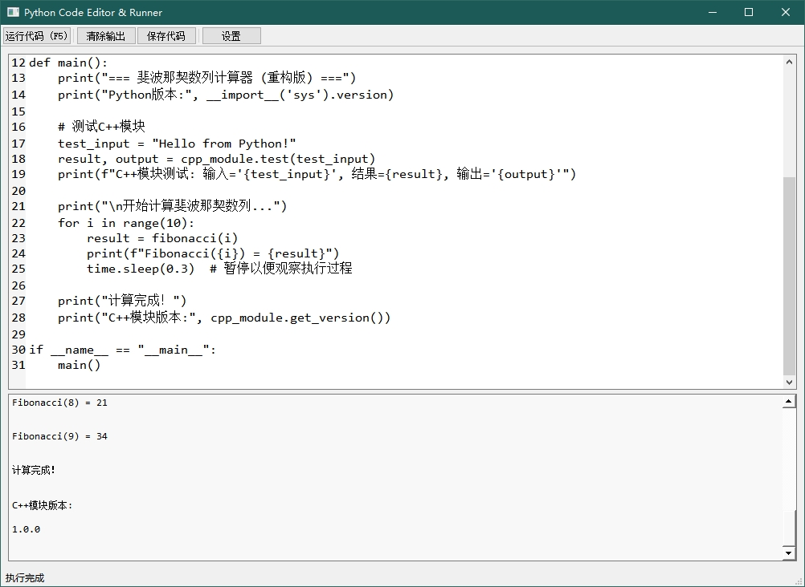

# QtPythonEmbed

一个基于Qt框架的Python解释器嵌入式应用，支持Python代码编辑、运行和调试。

> 本项目代码是使用[trae](https://www.trae.cn/)进行开发。

## 功能特点

- 📝 **Python代码编辑器**：支持语法高亮、行号显示、自动缩进
- ▶️ **Python代码运行**：在嵌入的Python解释器中执行代码
- 📊 **实时输出显示**：Python代码执行的输出实时显示在UI中
- 🔍 **行号追踪**：代码执行时高亮显示当前执行的行
- ⚙️ **可配置的Python环境**：支持自定义Python安装路径
- 📋 **示例代码**：内置示例代码，方便快速上手
- 🎯 **跨平台支持**：兼容Windows、Linux和macOS

## 系统要求

- Qt 5.15或更高版本
- C++17编译器
- Python 3.10或更高版本
- pybind11库

## 编译和运行

### Windows

1. 使用Qt Creator打开项目文件 `QtPythonEmbed.pro`
2. 配置构建套件（Kit）
3. 构建项目
4. 运行生成的可执行文件

### Linux

```bash
qmake
make
./QtPythonEmbed
```

### macOS

```bash
qmake
make
open QtPythonEmbed.app
```

## 项目结构

```
QtPythonEmbed/
├── CodeRunner.cpp              # Python代码执行器
├── CodeRunner.h                # Python代码执行器头文件
├── ConfigManager.cpp           # 配置管理器
├── ConfigManager.h             # 配置管理器头文件
├── PyEditor.cpp                # Python代码编辑器
├── PyEditor.h                  # Python代码编辑器头文件
├── PyWindow.cpp                # 主窗口
├── PyWindow.h                  # 主窗口头文件
├── PythonInterpreterManager.cpp # Python解释器管理器
├── PythonInterpreterManager.h   # Python解释器管理器头文件
├── QtPythonEmbed.pro            # Qt项目文件
└── main.cpp                     # 程序入口
```

## 核心组件说明

### PyEditor

Python代码编辑器，基于QPlainTextEdit实现，支持：
- 行号显示
- 自动缩进（Tab键插入4个空格）
- 语法高亮
- 当前行高亮
- 代码格式化

### CodeRunner

Python代码执行器，负责：
- 在独立线程中执行Python代码
- 设置Python追踪函数，实现行号追踪
- 处理Python输出和错误
- 支持代码执行中止

### PythonInterpreterManager

Python解释器管理器，使用单例模式，负责：
- Python解释器的初始化和清理
- Python环境配置（Python Home、路径等）
- 嵌入式Python模块注册
- Python输出重定向
- Python代码执行

### ConfigManager

配置管理器，负责：
- 应用配置的加载和保存
- 编辑器设置管理
- 自动保存设置

## 使用方法

1. **启动应用**：运行生成的可执行文件
2. **编辑代码**：在左侧编辑器中输入Python代码
3. **运行代码**：点击"运行"按钮执行代码
4. **查看输出**：右侧输出窗口显示代码执行结果
5. **配置Python环境**：点击"设置"按钮配置Python安装路径
6. **加载示例代码**：点击"示例"按钮加载示例代码
7. **保存代码**：点击"保存"按钮保存当前代码

## 配置说明

应用配置文件存储在以下位置：
- Windows: `C:/Users/<用户名>/AppData/Local/QtPythonEmbed/QtPythonEmbed.ini`
- Linux: `~/.config/QtPythonEmbed/QtPythonEmbed.ini`
- macOS: `~/Library/Preferences/org.qtproject.QtPythonEmbed.plist`

配置项说明：

| 配置项 | 说明 | 默认值 |
|--------|------|--------|
| Python/pythonHome | Python安装路径 | 自动检测 |
| Editor/font | 编辑器字体 | 系统默认字体 |
| Editor/fontSize | 编辑器字体大小 | 10 |
| Editor/autoSaveInterval | 自动保存间隔（秒） | 30 |

## 示例代码

应用内置了斐波那契数列计算器示例，演示了：
- Python基本语法
- 函数定义和调用
- 循环和条件语句
- 与C++模块的交互

## 注意事项

1. 首次运行时，应用会自动检测Python安装路径
2. 如果检测失败，请手动配置Python安装路径
3. 应用需要Python 3.10或更高版本
4. 代码执行时，编辑器会被禁用，执行完成后恢复
5. 可以通过"运行"按钮中止正在执行的代码

## 许可证

LGPL License

## 预览



## 联系方式

如有问题或建议，请通过以下方式联系：
- 项目地址：[https://github.com/sotex/QtPythonEmbed.git](https://github.com/sotex/QtPythonEmbed.git)
- 邮件：[ymwh@foxmail.com](mailto:ymwh@foxmail.com)
